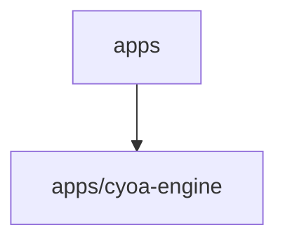

# 📚 mcp-games-monorepo Documentation

Welcome to the complete documentation for this repository. This documentation is automatically generated and maintained by Woden Docbot.

   

## 🔗 Quick Links

[📂 apps](./apps/README.md)
[📋 Dependencies](./DEPENDENCIES.md)

---

> Monorepo organizing game-related application implementations; provides an apps area currently containing a choose-your-own-adventure engine.

## 📖 Overview

This repository is organized as a monorepo for application-level game code. Its apps directory is the top-level container for runnable application implementations and related submodules. At present the apps area includes a single subdirectory, cyoa-engine, which holds the documented application implementation.

The structure treats apps as an organizational boundary: each runnable application and its documentation/code live in their own subdirectory under apps. Developers should navigate into each app subdirectory (for example apps/cyoa-engine) to find the actual runnable components, implementation details, and any app-specific documentation. The repository emphasizes modular organization over root-level scripts.

### 🧩 Key Components

| Component | Purpose | Technologies |
| --- | --- | --- |
| **apps** | Top-level container that groups runnable application code and related submodules; acts as an organizational boundary for application implementations. | N/A |
| **apps/cyoa-engine** | Subdirectory that contains the documented implementation of a choose-your-own-adventure (CYOA) engine application; where developers find the runnable component and its documentation. | N/A |

**Component Architecture:**

### 🏗️ Architecture

Monorepo layout organized around an apps directory that contains modular application subdirectories. Each app is self-contained under apps, making the repository an organizational collection of runnable applications.

### 💡 Use Cases

- ✦ Locate and run application implementations housed in the repository (e.g., the cyoa-engine)
- ✦ Develop or extend existing application modules by working inside their subdirectories under apps
- ✦ Add new application implementations to the monorepo by creating new subdirectories within apps

---

## 📑 Documentation Sections

### [apps](./apps/README.md)
Top-level container for application implementations and their related submodules, grouping runnable application code under the repository's apps area.

The apps directory is a container for application-level code and related submodules.

---

## 📊 Documentation Statistics

- **Files Documented**: 5
- **Directories**: 5
- **Coverage**: 100%
- **Last Updated**: 2026-07-09

---

## 🧭 How to Navigate

> ℹ️ **INFO**
> Each directory has its own README.md with detailed information about that section. Use the breadcrumb navigation at the top of each page to navigate back to parent directories.

### Navigation Features

- **Breadcrumbs** - At the top of each page, showing your current location
- **Directory READMEs** - Each folder has a comprehensive overview
- **File Documentation** - Click through to individual file documentation
- **Search** - Use GitHub's search or your IDE's search functionality

---

## 🤖 About Woden DocBot

This documentation is automatically generated and kept up-to-date by Woden DocBot, an AI-powered documentation assistant. DocBot analyzes code on every pull request and updates documentation to reflect changes.

### Features

- **Automatic Updates** - Documentation updates on every PR
- **Comprehensive Coverage** - Files, functions, classes, and directories
- **Smart Navigation** - Breadcrumbs, related files, and parent links
- **AI-Powered** - Uses Azure GPT models for intelligent documentation generation

---

*Generated by Woden DocBot for mcp-games-monorepo*